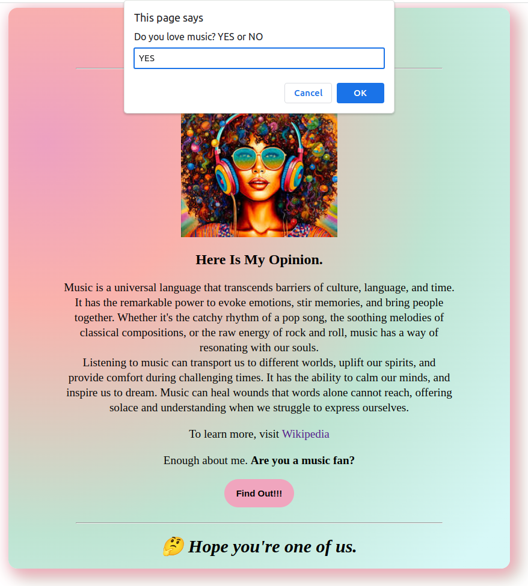

# Shecodes Frontend Web Design Final Project One

## Table of contents

- [Screenshot]
- [Built with]
- [What I learned]
- [Author]

### Screenshot

### Built with

- Semantic HTML5 markup
- CSS3 custom properties
- JavaScript

### What I learned

- Use prompts and alerts
- Use document.querySelector and eventListeners to access elements, manipulate them, and change the innerHTML

## Author

- Website - [Ambe Mbong-Nwi Nchang](https://github.com/Ambe-Mbong-Nwi)
