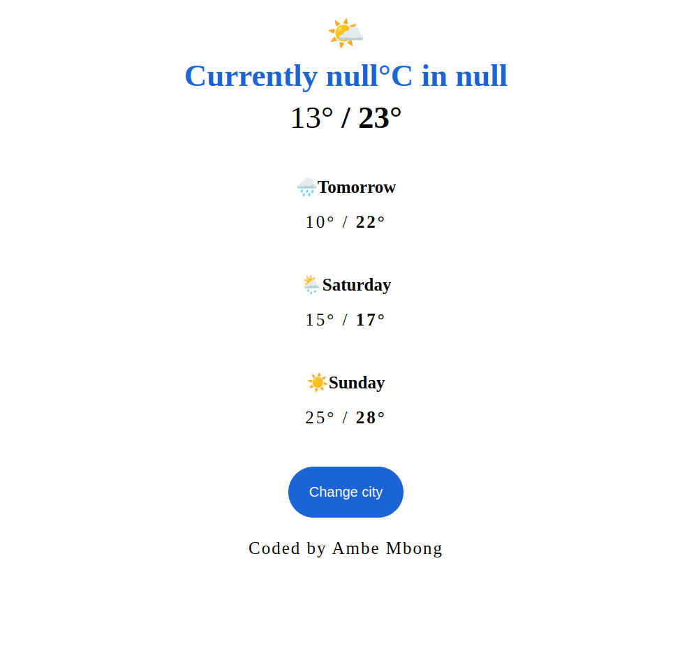

# Shecodes Frontend Web Design Week One

## Table of contents

- [Screenshot]
- [Built with]
- [What I learned]
- [Author]

### Screenshot

### Built with

- Semantic HTML5 markup
- CSS custom properties

### What I learned

- Use emojis using the emoji picker in vscode.
- Display degree symbol.

## Author

- Website - [Ambe Mbong-Nwi Nchang](https://github.com/Ambe-Mbong-Nwi)
